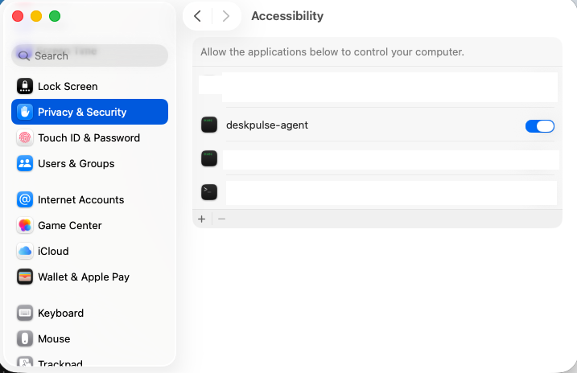

# DeskPulse

DeskPulse is a macOS background agent that keeps your session active, helping apps avoid switching you to an "Away" status.

## Prerequisits 

- MacOS

- Homebrew
Install homebrew 
```bash
/bin/bash -c "$(curl -fsSL https://raw.githubusercontent.com/Homebrew/install/HEAD/install.sh)"
```
More about Homebrew here 
https://brew.sh/

## Install (First time)

```bash
brew tap aresukio/deskpulse
brew install aresukio/deskpulse/deskpulse

deskpulse up // to trigger permission

// 1) Open System Settings -> Privacy & Security -> Accessibility 
// 2) Enable deskpulse-agent

deskpulse up // again

```

## Accessibility Permission (Required)

1. Open **System Settings -> Privacy & Security -> Accessibility**
2. Enable `deskpulse-agent` in the Accessibility list.



## Update to the latest version

```bash
deskpulse update

// Every new version will require trust to be granted again
// 1) Open System Settings -> Privacy & Security -> Accessibility 
// 2) Enable the newly aded deskpulse-agent

deskpulse up // again
```

## Useful commands

```bash
deskpulse help
deskpulse status
deskpulse logs
```
